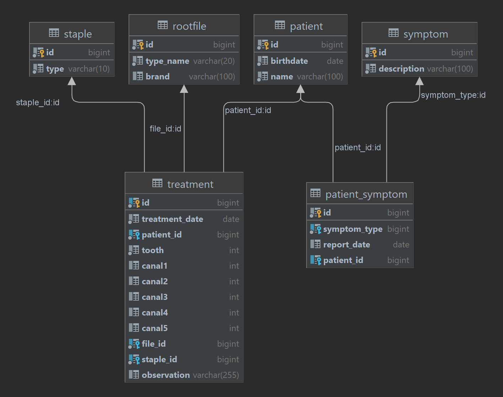

## First, the disclaimer

Since I'm migrating from embedded software development to work with Backend full-time, I'm starting a series of projects, this one here being the very first one, to learn and practice. 

I have no compromise to keep it fully functional or to make something quasi state-of-the-art, but I do want to make everything **"right"**, i.e., with good practices. 

If anything looks "wrong" or "silly", it might be because I dunno (yet) how to make it properly or because I'm _experimenting_ to see how things unfold. 

# FrameworklessApi

The intent of this project is to create a Rest API without the help of any framework. Yes,no Spring, no Javalin or whatever. Just the good and old java and JDBC.
Mind you, it is just for study, exploration and adventure.

## The proposed project

The FrameworklessApi gives access to a small and very simple service dedicated to record, manipulate and expose data about my wife's Root Canal patients. Since some data
that might be added is sensitive, only mock data will be available in this Repository. 

### The Model

The service will have data representation of:

* Patients
* Root Canal instruments, like:
  * File
  * Staples
* Most common symptoms
* Treatment details, like:
  * Tooth
  * instrument used
* Reported symptoms

Schema:

### There still work to do...

Although the project is a functional REST API, it lacks at least three things:
1 - A proper authentication/authorization layer
2 - More varied tests. Right now, only the basic stuff is tested (Is it inserting right? Updating Right? etc). It would be nice to have tests that check how the system deals with broken payloads or with a JSON that is missing some fields
3 - A nice endpoint that returns a documentation to how to use the API.

Except for the third one, that I might do sooner than later, I have no intention to do the other two in the near future. That's the case because I want to move to the other version of the same API, the one using Spring Boot and all its shenanigans
